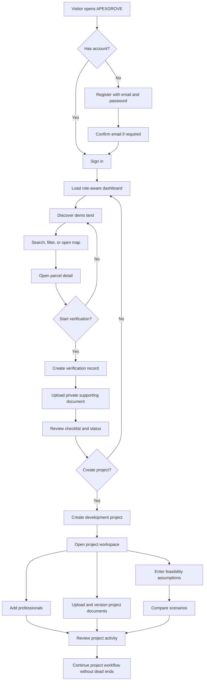
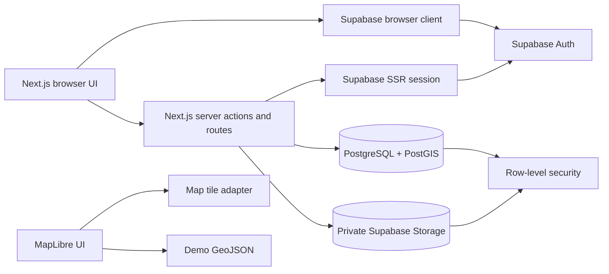

# APEXGROVE - Prototype Flow and Delivery Map

## Payment Decision

No payment service is required for the current prototype.

The prototype does not collect money, sell subscriptions, process land purchases, charge professionals, or manage construction payments. Land prices, feasibility revenue, and cost figures are demo estimates only.

Do not add Stripe, Paystack, Flutterwave, or another payment provider yet. Reserve a `PaymentProvider` adapter for a later phase so a real provider can be added without changing project, land, or accounting domains.

## Primary User Flow

## System Boundary Flow

## Delivery Phases

### Phase 0 - Design lock

**Output:** approved requirements, wireframes, design tokens, domain ownership rules, and test cases.

**Exit gate:** every must-work feature has an acceptance signal and a named test layer.

### Phase 1 - Foundation

**Output:** repository, environment, Supabase project, migrations, RLS, sessions, registration, login, role selection, and dashboard shell.

**Status:** foundation migrations and the first auth flow are working and manually verified.

**Remaining:** password reset, profile onboarding details, real RLS tests, storage bucket policy, and seed fixtures.

### Phase 2 - Land discovery

**Output:** land parcel schema, synthetic Abuja data, GeoJSON import, search/filter, list/map toggle, map selection, and parcel detail.

**Exit gate:** a signed-in user can discover and open a clearly labelled demo parcel.

### Phase 3 - Verification and documents

**Output:** verification lifecycle, checklist, private storage, document metadata, versioning, reviewer notes, and audit events.

**Exit gate:** a user can submit evidence without any public document URL or fake verification badge.

### Phase 4 - Projects and professionals

**Output:** create a project from a parcel, project workspace, membership rules, professional directory, and project documents.

**Exit gate:** a parcel can move into a persisted project workspace with controlled access.

### Phase 5 - Feasibility and admin

**Output:** deterministic feasibility calculations, scenario comparison, demo-data admin tools, and audit review.

**Exit gate:** the core prototype journey works against persisted data from registration through feasibility.

### Phase 6 - Integration and release confidence

**Output:** replace reserved tests with real unit/integration/E2E coverage, responsive/accessibility review, error-state review, and a deployable preview.

**Exit gate:** `npm test`, typecheck, lint, build, and the complete Playwright journey pass without fake success states.

## Execution Rule

Work in vertical slices. For each phase:

1. Define the data and permission contract.
2. Write the unit and integration tests.
3. Implement the server and database boundary.
4. Implement the UI states.
5. Add the E2E path.
6. Run the phase exit gate before starting the next phase.

Do not build disconnected screens ahead of the data boundary they depend on.